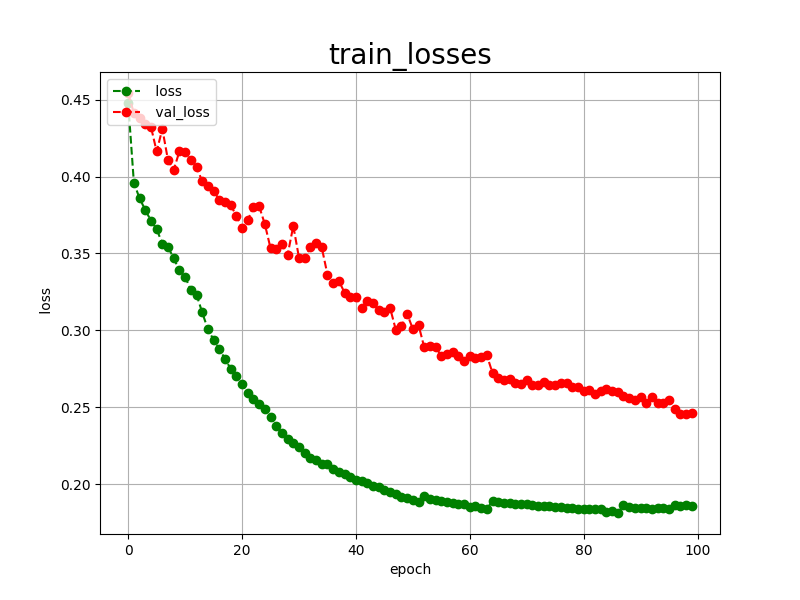
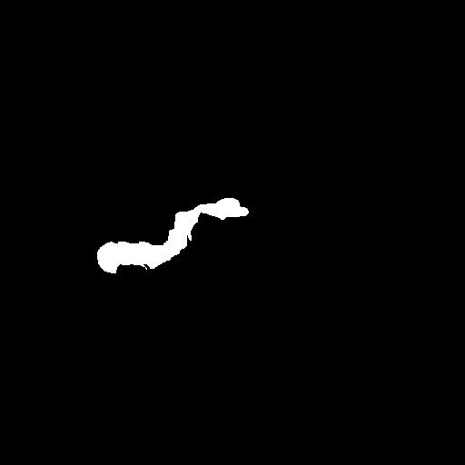

<h2>Tensorflow-Image-Segmentation-Pancreas-T1W-MRI (2025/05/04)</h2>
Sarah T. Arai 
Software Laboratory antillia.com  

This is the first experiment of Image Segmentation for Pancreas-T1W MRI Images based on
the <a href="https://github.com/sarah-antillia/Tensorflow-Image-Segmentation-API">Tensorflow-Image-Segmentation-API</a>, and
<a href="https://drive.google.com/file/d/15sTp6iWcmsKeBetI0p60GYcwqfel-ekR/view?usp=sharing">Pancreas-T1-ImageMaskDataset.zip</a>, 
which is a subset of T1W (t1.zip) in the original Pancreas_MRI_Dataset of OSF Storage <a href="https://osf.io/kysnj/">
<b>PanSegData.</b></a>  

Please see also our experiment. 
<li> <a href="https://github.com/sarah-antillia/Tensorflow-Image-Segmentation-Pancreas-T2W-MRI">Tensorflow-Image-Segmentation-Pancreas-T2W-MRI<a/></li>

 

<b>Actual Image Segmentation for Images of 512x512 pixels</b> 
 The inferred colorized masks predicted by our segmentation model trained on the T1-ImageMaskDataset appear 
 similar to the ground truth masks, but lack precision in some areas. To improve segmentation accuracy, 
 we could consider using a different segmentation model better suited for this task, 
 or explore online data augmentation strategies.
<table>
<tr>
<th>Input: image</th>
<th>Mask (ground_truth)</th>
<th>Prediction: inferred_mask</th>
</tr>
<tr>
<td></td>
<td></td>
<td></td>
</tr>

<tr>
<td></td>
<td></td>
<td></td>
</tr>
<tr>
<td></td>
<td></td>
<td></td>
</tr>

</table>

 
In this experiment, we used the simple UNet Model 
<a href="./src/TensorflowUNet.py">TensorflowSlightlyFlexibleUNet</a> for this Pancreas-T1 Segmentation. 
As shown in <a href="https://github.com/sarah-antillia/Tensorflow-Image-Segmentation-API">Tensorflow-Image-Segmentation-API</a>.
you may try other more advanced TensorFlow UNet Models to get better segmentation models: 
 
<li><a href="./src/TensorflowSwinUNet.py">TensorflowSwinUNet.py</a></li>
<li><a href="./src/TensorflowMultiResUNet.py">TensorflowMultiResUNet.py</a></li>
<li><a href="./src/TensorflowAttentionUNet.py">TensorflowAttentionUNet.py</a></li>
<li><a href="./src/TensorflowEfficientUNet.py">TensorflowEfficientUNet.py</a></li>
<li><a href="./src/TensorflowUNet3Plus.py">TensorflowUNet3Plus.py</a></li>
<li><a href="./src/TensorflowDeepLabV3Plus.py">TensorflowDeepLabV3Plus.py</a></li>
 

<h3>1. Dataset Citation</h3>
The dataset used here has been taken from OSF HOME <a href="https://osf.io/kysnj/"><b>PanSegData</b></a> 
Contributors: Ulas Bagci Debesh Jha Zheyuan Zhang Elif Keles 
Date created: 2024-04-28 02:14 PM | Last Updated: 2024-07-08 11:41 PM 
Identifier: DOI 10.17605/OSF.IO/KYSNJ 
Category:  Data 
Description: <i>The dataset consists of 767 MRI scans (385 TIW) and 382 T1W scans from five 
different institutions.</i> 
License: <i>GNU General Public License (GPL) 3.0</i>  
 

<h3>
<a id="2">
2 Pancreas-T1 ImageMask Dataset
</a>
</h3>
 If you would like to train this Pancreas-T1 Segmentation model by yourself,
 please download the dataset from the google drive 
<a href="https://drive.google.com/file/d/15sTp6iWcmsKeBetI0p60GYcwqfel-ekR/view?usp=sharing">Pancreas-T1-ImageMaskDataset.zip</a>, 
 
Please expand the downloaded ImageMaskDataset and place it under <b>./dataset</b> folder to be
<pre>
./dataset
└─Pancreas-T1
    ├─test
    │   ├─images
    │   └─masks
    ├─train
    │   ├─images
    │   └─masks
    └─valid
        ├─images
        └─masks
</pre>
On the derivation of this dataset, please refer to the following Python scripts in <a href="./generator">generator</a>. 
<li><a href="./generator/ImageMaskDatasetGenerator.py">ImageMaskDatasetGenerator.py</a></li>
<li><a href="./generator/split_master.py">split_master.py</a></li>
 

<b>Pancreas-T1 Dataset Statistics</b> 
 
 
As shown above, the number of images of train and valid dataset is enough large for use our segmentation model. 
 
<b>Train_images_sample</b> 

 
<b>Train_masks_sample</b> 

 

<h3>
4 Train TensorflowUNet Model
</h3>
 We trained Pancreas-T1 TensorflowUNet Model by using the 
<a href="./projects/TensorflowSlightlyFlexibleUNet/Pancreas-T1/train_eval_infer.config"> <b>train_eval_infer.config</b></a> file.  
Please move to ./projects/Pancreas-T1 and run the following bat file for Python script <a href="./src/TensorflowUNetTrainer.py">TensorflowUNetTrainer.py</a>. 
<pre>
>1.train.bat
</pre>
, which simply runs the following command. 
<pre>
>python ../../../src/TensorflowUNetTrainer.py ./train_eval_infer.config
</pre>

<h3>The summary of train_eval_infer.config</h3>.
<b>Model parameters</b> 
Defined small <b>base_filters</b> and large <b>base_kernels</b> for the first Conv Layer of Encoder Block of 
<a href="./src/TensorflowUNet.py">TensorflowUNet.py</a> 
and large num_layers (including a bridge).
<pre>
[model]
model         = "TensorflowUNet"
base_filters   = 16 
base_kernels   = (9,9)
num_layers     = 8
dilation       = (3,3)
</pre>

<b>Online augmentation</b> 
Disabled our online augmentation tool. To enable ir, set generator parameter to True.  
<pre>
[model]
generator     = False
</pre>

<b>Loss and metrics functions</b> 
Specified "bce_dice_loss" and "dice_coef". 
<pre>
[model]
loss           = "bce_dice_loss"
metrics        = ["dice_coef"]
</pre>
<b>Learning rate reducer callback</b> 
Enabled learing_rate_reducer callback. 
<pre> 
[train]
learning_rate_reducer = True
reducer_factor        = 0.4
reducer_patience      = 4
</pre>
<b>Early stopping callback</b> 
Enabled early stopping callback with patience parameter.
<pre>
[train]
patience      = 10
</pre>

<b>Epoch change inference callback</b> 
Enabled EpochChange infer callback. 
<pre>
[train]
epoch_change_infer     = True
epoch_change_infer_dir =  "./epoch_change_infer"
num_infer_images       = 6
</pre>

By using this EpochChangeInference callback, on every epoch_change, the inference procedure can be called
 for 6 bimages in <b>mini_test</b> folder. This will help you confirm how the predicted mask changes at each epoch during your training process.  
 

<b>Epoch_change_inference output at start (1,2,3)</b> 
 
 
 
<b>Epoch_change_inference output at end (98,99,100)</b> 
 
 
 

In this case, the training process terminated at epoch 100 as shown below. 
<b>Training console output</b> 
 
 
<a href="./projects/TensorflowSlightlyFlexibleUNet/Pancreas-T1/eval/train_metrics.csv">train_metrics.csv</a> 
 

 
<a href="./projects/TensorflowSlightlyFlexibleUNet/Pancreas-T1/eval/train_losses.csv">train_losses.csv</a> 
 

 

<h3>
5 Evaluation
</h3>
Please move to a <b>./projects/TensorflowSlightlyFlexibleUNet/Pancreas-T1</b> folder, 
and run the following bat file to evaluate TensorflowUNet model for Pancreas-T1. 
<pre>
./2.evaluate.bat
</pre>
This bat file simply runs the following command.
<pre>
python ../../../src/TensorflowUNetEvaluator.py ./train_eval_infer_aug.config
</pre>

Evaluation console output: 

  

The loss (bce_dice_loss) score for this "Pancreas-T1/test" dataset is not low, but dice_coef not high as shown below. 
<pre>
loss,0.2368
dice_coef,0.5769
</pre>

<h3>
6 Inference
</h3>
Please move to a <b>./projects/TensorflowSlightlyFlexibleUNet/Pancreas-T1</b> folder 
,and run the following bat file to infer segmentation regions for images by the Trained-TensorflowUNet model for Pancreas-T1. 
<pre>
./3.infer.bat
</pre>
This simply runs the following command.
<pre>
python ../../../src/TensorflowUNetInferencer.py ./train_eval_infer_aug.config
</pre>

<b>mini_test_images</b> 
 
<b>mini_test_mask(ground_truth)</b> 
 

<b>Inferred test masks</b> 
 
 

<b>Enlarged images and masks (512x512 pixels)</b> 

<table>
<tr>
<th>Image</th>
<th>Mask (ground_truth)</th>
<th>Inferred-mask</th>
</tr>
<tr>
<td></td>
<td></td>
<td></td>
</tr>

<tr>
<td></td>
<td></td>
<td></td>
</tr>

<tr>
<td></td>
<td></td>
<td></td>
</tr>

<tr>
<td></td>
<td></td>
<td></td>
</tr>
<tr>
<td></td>
<td></td>
<td></td>
</tr>

<tr>
<td></td>
<td></td>
<td></td>
</tr>

</table>

 
 
<!--
  -->

<h3>
References
</h3>
<b>1. Large-Scale Multi-Center CT and MRI Segmentation of Pancreas with Deep Learning </b> 
 Zheyuan Zhanga, Elif Kelesa, Gorkem Duraka, Yavuz Taktakb, Onkar Susladkara, Vandan Goradea, Debesh Jhaa,  
 Asli C. Ormecib, Alpay Medetalibeyoglua, Lanhong Yaoa, Bin Wanga, Ilkin Sevgi Islera, Linkai Penga,  
 Hongyi Pana, Camila Lopes Vendramia, Amir Bourhania, Yury Velichkoa, Boqing Gongd, Concetto Spampinatoe,  
 Ayis Pyrrosf, Pallavi Tiwarig, Derk C F Klatteh, Megan Engelsh, Sanne Hoogenboomh, Candice W. Bolani,  
 Emil Agarunovj, Nassier Harfouchk, Chenchan Huangk, Marco J Brunol, Ivo Schootsm, Rajesh N Keswanin,  
 Frank H Millera, Tamas Gondaj, Cemal Yazicio, Temel Tirkesp, Baris Turkbeyq, Michael B Wallacer, Ulas Bagcia, 

<a href="https://arxiv.org/pdf/2405.12367">https://arxiv.org/pdf/2405.12367</a>
 
<a href="https://github.com/NUBagciLab/PANSegNet">Large-Scale Multi-Center CT and MRI Segmentation of Pancreas with Deep Learning</a>
 
 
<b>2. Pancreas Segmentation in MRI using Graph-Based Decision Fusion on Convolutional Neural Networks</b> 
Jinzheng Cai, Le Lu, Zizhao Zhang, Fuyong Xing, Lin Yang, Qian Yin
 
<a href="https://pmc.ncbi.nlm.nih.gov/articles/PMC5223591/">https://pmc.ncbi.nlm.nih.gov/articles/PMC5223591/</a>
 
 
<b>2. ImageMask-Dataset-Pancreas-T2</b> 
Toshiyuki Arai antillia.com 
<a href="https://github.com/sarah-antillia/ImageMask-Dataset-Pancreas-T2">https://github.com/sarah-antillia/ImageMask-Dataset-Pancreas-T2
</a>
 
 

<b>3. Tensorflow-Image-Segmentation-Pancreas-T2W-MRI</b> 
Toshiyuki Arai antillia.com 
<a href="https://github.com/sarah-antillia/Tensorflow-Image-Segmentation-Pancreas-T2W-MRI">
Tensorflow-Image-Segmentation-Pancreas-T2W-MRI<a/> 

